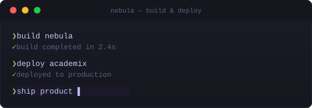

<div align="center">

<!-- ══════════════════════════════════════════════════════════════════
     HERO — NEBULA × YACINE KATROUCI
     ══════════════════════════════════════════════════════════════════ -->


<!-- Social Badges -->

<br/>

[](https://www.linkedin.com/in/yacine-katrouci-32224b29a/)
[](https://www.instagram.com/yacine__kay/)
[](mailto:yacinekatrouci@gmail.com)
[](https://wa.me/213657572115)
[](https://nebuladev.netlify.app/)
[](https://yacine-katrouci.netlify.app/)
[](https://github.com/yacinekat)

</div>

<!-- ══════════════════════════════════════════════════════════════════
     DIVIDER
     ══════════════════════════════════════════════════════════════════ -->

<p align="center">
  
</p>

<!-- ══════════════════════════════════════════════════════════════════
     NEBULA — WHAT WE'RE BUILDING
     ══════════════════════════════════════════════════════════════════ -->

<div align="center">

### ◈ NEBULA


</div>

> *"I don't just write code — I build systems that evolve into products."*

<div align="center">

**Nebula** is a Systems & Product Engineering company. We design and develop **SaaS platforms**, **web applications**, and **digital infrastructure** — turning operational problems into scalable software.



</div>

<table align="center">
<tr>
<td width="50%" valign="top">

```yaml
company:  Nebula
focus:    Systems & Product Engineering
status:   Actively Building ⚡
```

</td>
<td width="50%" valign="top">

```yaml
products:
  - Academix    # School management system
  - [More]      # Currently in development
approach:
  - Build real products
  - Solve real problems
  - Ship continuously
```

</td>
</tr>
</table>

<!-- ══════════════════════════════════════════════════════════════════
     DIVIDER
     ══════════════════════════════════════════════════════════════════ -->

<p align="center">
  
</p>

<!-- ══════════════════════════════════════════════════════════════════
     ABOUT ME
     ══════════════════════════════════════════════════════════════════ -->

<div align="center">

### ◈ ABOUT ME

</div>

I'm a software engineer who builds products — not just code.

My work sits at the intersection of **systems engineering** and **product thinking**. I design, develop, and ship software that solves real operational problems — from architecture to deployment, from concept to product.

- 🏗️ &nbsp; **[Nebula](https://nebuladev.netlify.app/)** — Founder, building a product engineering company
- 🎓 &nbsp; **Academix** — First major product under Nebula
- 🔧 &nbsp; **Full-stack engineering** — Frontend to backend, design to deployment
- 🐧 &nbsp; **Systems thinker** — Linux, infrastructure, and deep system understanding
- 🎯 &nbsp; **Product-first** — Driven by *what* to build, not just *how* to build it

<!-- ══════════════════════════════════════════════════════════════════
     WHAT I BUILD
     ══════════════════════════════════════════════════════════════════ -->

<div align="center">

### ◈ WHAT I BUILD

</div>

<table>
<tr>
<td align="center" width="33%">

**🚀 SaaS Products**

End-to-end software-as-a-service platforms designed around real workflows

</td>
<td align="center" width="33%">

**🌐 Web Applications**

Full-stack applications with modern frontend frameworks and robust backends

</td>
<td align="center" width="33%">

**⚡ Backend Systems**

Scalable APIs, database architecture, and server infrastructure

</td>
</tr>
<tr>
<td align="center" width="33%">

**📱 Mobile Apps**

Cross-platform mobile experiences with Flutter

</td>
<td align="center" width="33%">

**🏫 School Management**

Educational system platforms — the foundation of Academix

</td>
<td align="center" width="33%">

**🏗️ Product Infrastructure**

Foundation systems and architecture that scale with the product

</td>
</tr>
</table>

<!-- ══════════════════════════════════════════════════════════════════
     FEATURED PRODUCT — ACADEMIX
     ══════════════════════════════════════════════════════════════════ -->

<div align="center">

### ◈ FEATURED PRODUCT

#### 🎓 Academix

A comprehensive **school management system** built to streamline educational administration — from student enrollment and attendance tracking to grade management, scheduling, and parent communication.

**Who it's for:** Schools, educational institutions, and administrators who need a unified digital platform to manage operations.

**The problem it solves:** Fragmented school administration — paper-based records, disconnected tools, and manual workflows that waste time and create errors.

**Status:** Active development — currently building core modules under Nebula.

`TypeScript` `React` `Node.js` `Express` `PostgreSQL`

[](https://github.com/yacinekat)

</div>

<!-- ══════════════════════════════════════════════════════════════════
     DIVIDER
     ══════════════════════════════════════════════════════════════════ -->

<p align="center">
  
</p>

<!-- ══════════════════════════════════════════════════════════════════
     TECH STACK
     ══════════════════════════════════════════════════════════════════ -->

<div align="center">

### ◈ TECH STACK

*The engineering toolkit I use to build products.*

#### 🔤 Languages


#### 🎨 Frontend


#### ⚡ Backend


#### 🗄️ Databases & Cache


#### 🐳 DevOps & Infrastructure


#### ☁️ Deployment


#### 🛠️ Tools


</div>

<!-- ══════════════════════════════════════════════════════════════════
     DIVIDER
     ══════════════════════════════════════════════════════════════════ -->

<p align="center">
  
</p>

<!-- ══════════════════════════════════════════════════════════════════
     BUILDING IN PUBLIC
     ══════════════════════════════════════════════════════════════════ -->

<div align="center">

### ◈ BUILDING IN PUBLIC

*Every commit is a step forward. Here's the visible trace of what I'm building.*


<br/>



<!-- Contribution snake — generated by .github/workflows/snake.yml -->
<picture>
  <source media="(prefers-color-scheme: dark)" srcset="https://raw.githubusercontent.com/YacineKat/YacineKat/output/github-snake-dark.svg"/>
  <source media="(prefers-color-scheme: light)" srcset="https://raw.githubusercontent.com/YacineKat/YacineKat/output/github-snake-light.svg"/>
  
</picture>


</div>

<!-- ══════════════════════════════════════════════════════════════════
     DIVIDER
     ══════════════════════════════════════════════════════════════════ -->

<p align="center">
  
</p>

<!-- ══════════════════════════════════════════════════════════════════
     LET'S CONNECT
     ══════════════════════════════════════════════════════════════════ -->

<div align="center">

### ◈ LET'S BUILD SOMETHING

I'm always open to **collaborating on ambitious projects**, discussing **product ideas**, or connecting with other builders.

[](https://www.linkedin.com/in/yacine-katrouci-32224b29a/)
[](https://github.com/yacinekat)
[](mailto:yacinekatrouci@gmail.com)
[](https://wa.me/213657572115)
[](https://www.instagram.com/yacine__kay/)
[](https://nebuladev.netlify.app/)
[](https://yacine-katrouci.netlify.app/)

<!-- ══════════════════════════════════════════════════════════════════
     WAVE
     ══════════════════════════════════════════════════════════════════ -->


<!-- ══════════════════════════════════════════════════════════════════
     FOOTER — NEBULA
     ══════════════════════════════════════════════════════════════════ -->


Built with intention. Powered by **Nebula**.

</div>
